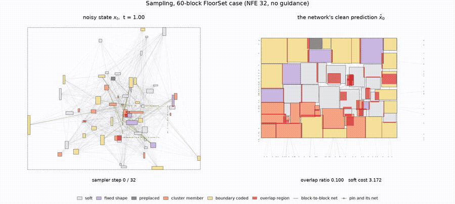
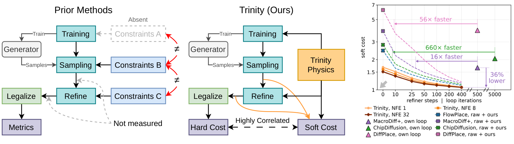
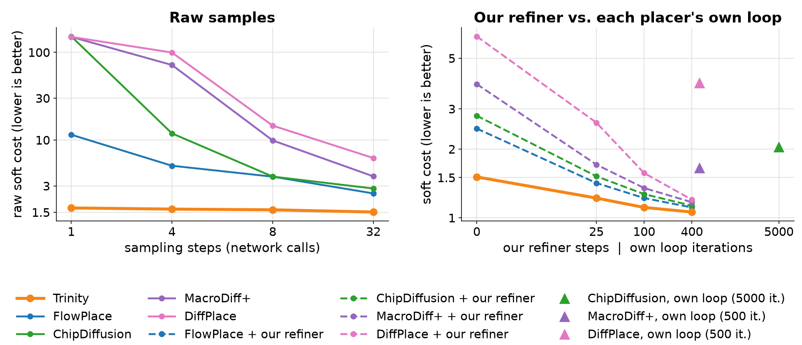
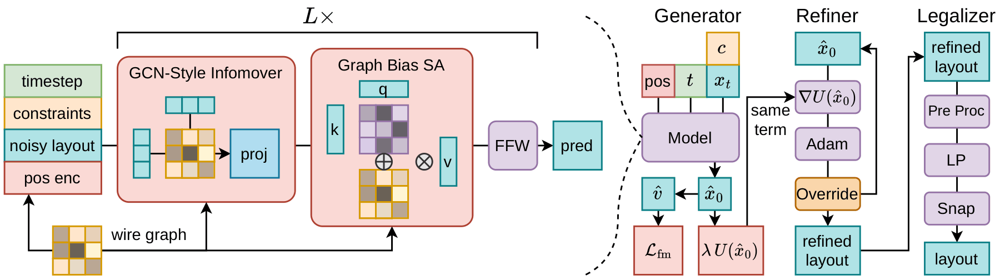

# Trinity: One Differentiable Physics for Training, Refining and Scoring Generative Floorplanners

**Shih-Ying Yeh**<sup>♡♠†</sup>, **Tzu-Sian Wang**<sup>♡</sup>, **Xuehai Wang**<sup>♣△</sup>, **Jia-Hua Lee**<sup>★</sup>, **Daniel Z. Kaplan**<sup>◇</sup>, **Ming-Qi Xu**<sup>♡</sup>, **Wuqian Tang**<sup>♡</sup>, **Chun-Yao Wang**<sup>♡</sup>, **Shang-Hong Lai**<sup>♡</sup>, **Chun-Yi Lee**<sup>★</sup>

<sup>♡</sup>National Tsing Hua University · <sup>♠</sup>Kohaku Lab · <sup>♣</sup>Karolinska Institutet · <sup>△</sup>Stockholm University · <sup>◇</sup>realiz.ai · <sup>★</sup>National Taiwan University
<sup>†</sup>Corresponding author: kohaku@kblueleaf.net

[Project page](https://kohaku-lab.github.io/Trinity/) · [arXiv (coming soon)](#) · [Models](https://huggingface.co/KBlueLeaf/Trinity)



Existing generative floorplanners train only to reproduce reference layouts and leave the rules
of the chip to corrections bolted on afterwards: guidance in the sampler, post-hoc loops and a
legalizer, each in its own form, with only the final layout ever scored. Trinity writes every
constraint and objective of floorplanning once, as six differentiable functions of the layout
(overlap, grouping, MIB, boundary, wirelength, area), and uses that one physics three times:

* **training**: as a term of the denoiser's loss, so the network learns the correction and
  sampling needs no guidance;
* **refining**: as the energy a closed-form refiner descends on a finished sample;
* **scoring**: as a soft cost that measures a layout at every stage, before legalization.



## Results

Four recent diffusion placers (FlowPlace, ChipDiffusion, MacroDiff+, DiffPlace) re-implemented
on the same data and training recipe, every model scored at every stage on 12,000 held-out
FloorSet chips.



| | |
|---|---|
| raw soft cost, physics term on vs. off (same transformer) | **−26%** |
| steps for our refiner to match each placer's own loop | **16–660× fewer** |
| refined soft cost vs. the best existing pipeline | **−36%** |
| soft cost vs. hard cost, rank agreement across settings (Spearman) | **0.94** |
| FloorSet validation set, mean hard cost (best of 48) | **1.014 at 1.63 s per chip** |

The physics term needs no reference layout, so it keeps supervising where the data runs out.
On GSRC, with chips beyond FloorSet's 21 to 120 blocks and a 10% dead-space outline:

| GSRC | with physics: wirelength / fits | without physics: wirelength / fits | PARSAC |
|---|---|---|---|
| n100 | 294.7 mm / 36% of draws | 293.9 mm / 80% | 303.5 mm |
| n200 | **554.9 mm / 100%** | 560.1 mm / 0% (outline 440 × 498 > 440 × 440) | 576.0 mm |
| n300 | 681.3 mm / 0% | 679.8 mm / 0% | 705.2 mm |

At 300 blocks no checkpoint fits the outline, an open limit of the generator on sizes far
beyond training.



This repository holds the code of the paper: the model, its training, the sampler, the
refiner, the legalizer, every evaluation, and every baseline. It contains no result files.

## Install

```bash
git clone https://github.com/Kohaku-Lab/Trinity.git
cd Trinity
pip install -e .                 # trinity + trinity_baselines
pip install -e ".[baselines]"    # + torch_geometric for the ported published placers
pip install -e ".[dev]"          # + pytest, black, ruff
```

Python ≥ 3.13, PyTorch ≥ 2.12.

## Quick start

Released models (the flagship and eight smaller sizes) are on the Hugging Face Hub as
`KBlueLeaf/Trinity`, one subfolder per size:

```python
from trinity.floorplan.data import load_validation_case
from trinity.floorplan.scoring import validate
from trinity.hub import load_model

model = load_model("KBlueLeaf/Trinity", scale="flagship", device="cuda")
placer = model.placer(samples=16)  # sampler -> closed-form refiner -> legalizer, best of 16
instance = load_validation_case(60)  # FloorSet validation case with 60 blocks
placement = placer.solve(instance)
print(validate(placement, "full").score)
```

| size | width × depth | parameters |
|---|---|---|
| `flagship` | 768 × 12 | 92.9 M |
| `d512_l16` | 512 × 16 | 56.0 M |
| `d512` | 512 × 12 | 42.1 M |
| `d384` | 384 × 12 | 23.3 M |
| `d256` | 256 × 12 | 10.6 M |
| `d192` | 192 × 12 | 5.9 M |
| `l8` | 768 × 8 | 62.2 M |
| `l6` | 768 × 6 | 46.8 M |
| `l4` | 768 × 4 | 31.5 M |

The sampler writes the known answers into its state by default (preplaced and fixed blocks,
one shared shape per MIB group; [docs/sampling.md](docs/sampling.md)). The paper's
experiments sample free: `model.placer(projections=[])`.

## Running the experiments

Every script is a [kohaku-engine](https://pypi.org/project/kohaku-engine/) script, run with a
config file; any knob can also be overridden with a typed `--set KEY=VALUE`.

```bash
# data: download FloorSet-Lite and build the training set
python -c "from trinity.floorplan.data import download_train_raw; download_train_raw()"
kogine run scripts/data/transcode_floorset.py

# training
kogine run scripts/train/diffusion.py --config configs/train/flagship.py

# evaluation over the 12k dev split
kogine run scripts/eval/generate.py --config configs/eval/flagship/generate.py
kogine run scripts/eval/score.py    --config configs/eval/flagship/score.py
kogine run scripts/eval/legalize.py --config configs/eval/flagship/legalize.py
```

The configs under `configs/` show one of each experiment of the paper; the other runs change
one or two knobs of these.

## Layout

```
src/trinity/floorplan/   the problem: FloorSet / bookshelf data, geometry, scoring, legalization
src/trinity/             the method: conditioning, models, framings, losses, training,
                         sampling, the refiner, the placer, the model hub loader
src/trinity_baselines/   the baselines: regressors, ported published placers, classic solvers
scripts/                 kohaku-engine scripts (data, train, eval, baselines, profile, theory)
configs/                 config files for the scripts
docs/                    how to run things and how to read the code
tests/                   pytest suite
```

## Documentation

* [docs/code.md](docs/code.md) — how to read the code: the packages, the registries, one
  sample's path through them
* [docs/physics.md](docs/physics.md) — the six constraint terms
* [docs/data.md](docs/data.md) — data sources, the training set, the dev split
* [docs/training.md](docs/training.md) — the training script, configs and recipe
* [docs/sampling.md](docs/sampling.md) — the sampler, state projections, the placer pipeline
* [docs/refiner.md](docs/refiner.md) — the closed-form refiner
* [docs/legalizer.md](docs/legalizer.md) — the legalizer (`scale_pack`)
* [docs/evaluation.md](docs/evaluation.md) — the evaluation chain and its metrics
* [docs/baselines.md](docs/baselines.md) — regressors, ported published placers, classic solvers

## Citation

```bibtex
@misc{trinity2026,
  title  = {Trinity: One Differentiable Physics for Training, Refining and Scoring Generative Floorplanners},
  author = {Yeh, Shih-Ying and Wang, Tzu-Sian and Wang, Xuehai and Lee, Jia-Hua and Kaplan, Daniel Z. and
            Xu, Ming-Qi and Tang, Wuqian and Wang, Chun-Yao and Lai, Shang-Hong and Lee, Chun-Yi},
  year   = {2026},
  note   = {arXiv identifier to appear}
}
```

## License

Apache-2.0 ([LICENSE](LICENSE)). Third-party code, data and models used by this repository
keep their own licenses; see [NOTICE](NOTICE).
